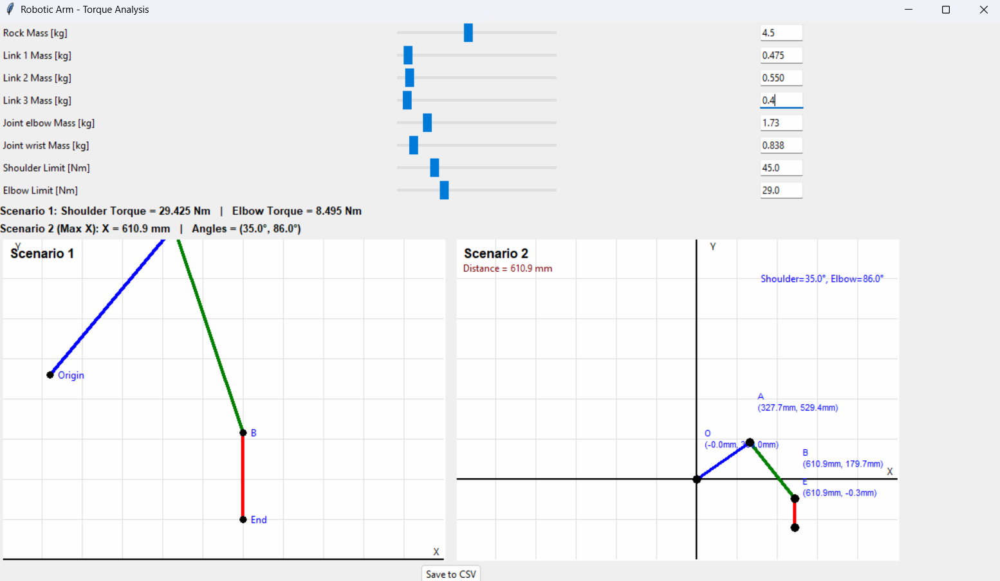

# Robotic Arm - Torque Analysis

  
*(Replace with an actual screenshot path.)*

## Overview
A concise Python **Tkinter** application for analyzing **joint torques** in a 3‑link robotic arm under two scenarios:

1. **Scenario 1**  
   - A fixed geometry that computes the **shoulder** and **elbow** torques based on static link/joint positions.  

2. **Scenario 2**  
   - A brute‑force search determining the maximum **horizontal reach** without exceeding user‑specified motor torque limits.  

## Key Features
- **Mass & Torque Adjustment**  
  Users can interactively modify link masses, joint masses, and the rock (payload) mass, as well as motor torque limits.  
- **Real‑Time Calculations**  
  The shoulder/elbow torque values and maximum extension are updated immediately on any parameter change.  
- **CSV Data Logging**  
  A single click saves current parameters (masses, limits, etc.) to a CSV file for record‑keeping or further analysis.

## Highlights
- **Lightweight GUI** built with Python’s Tkinter, providing interactive sliders and fields.
- **Direct Visualization** of each scenario in a canvas, showing link geometry and torque readouts.
- **Simple & Extendable** code structure, making it easy to add new calculations or scenarios.

## License
Released under the [MIT License](https://opensource.org/licenses/MIT). You are free to use, modify, and distribute this software.
